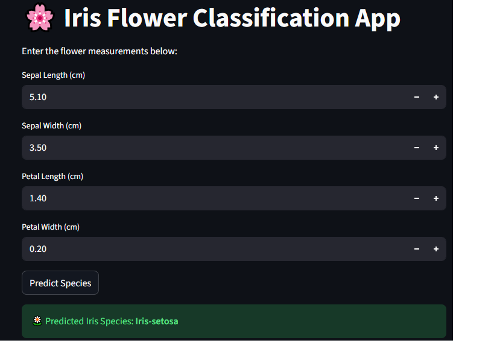
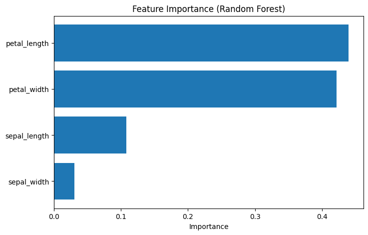

# Iris Flower Classification using Machine Learning 🌸
## 🚀 Live Demo
🔗 **App URL:** https://iris-ml-project-c2ekwuujex5b8ikvukegpv.streamlit.app/

## 📸 App Preview

## 📊 Feature Importance

The plot below shows which features contributed most to the Iris species classification.
Petal length and petal width are the most important features.

## 📌 Project Overview
This project is a beginner-friendly Machine Learning project that classifies iris flowers into three species based on their physical characteristics.

The goal is to understand the complete ML workflow:
- Data loading
- Exploratory Data Analysis (EDA)
- Model training
- Model evaluation
- Feature importance analysis
- Version control using Git and GitHub

---

## 📊 Dataset
The dataset used is the **Iris Flower Dataset**, which contains 150 samples of iris flowers.

**Features:**
- Sepal Length
- Sepal Width
- Petal Length
- Petal Width

**Target Classes:**
- Iris-setosa
- Iris-versicolor
- Iris-virginica

Dataset source: Kaggle (Iris Flower Dataset)

---

## ⚙️ Technologies Used
- Python
- NumPy
- Pandas
- Matplotlib & Seaborn
- Scikit-learn
- Google Colab
- Git & GitHub

---

## 🧠 Machine Learning Models Used
- Logistic Regression
- Random Forest Classifier
- Support Vector Machine (SVM)
- K-Nearest Neighbors (KNN)

---

## 📈 Results
- Achieved **~97% accuracy** on the test dataset
- Random Forest and SVM performed best
- Feature importance analysis showed that **petal length and petal width** are the most important features

---

## 🔍 Feature Importance
The Random Forest model was used to analyze feature importance, helping understand which flower measurements contribute most to classification.

---

## 🚀 How to Run the Project
1. Open the notebook `Iris_ML_Project.ipynb`
2. Run all cells sequentially
3. Observe EDA, model training, and evaluation results

---

## 📌 Conclusion
This project demonstrates an end-to-end Machine Learning workflow and serves as a strong foundation for beginners learning ML and GitHub.

Future improvements may include:
- Building a web app using Streamlit
- Trying dimensionality reduction (PCA)
- Deploying the model to the cloud

---

## 👩‍💻 Author
**Bhumika R**  
Beginner Machine Learning Enthusiast
